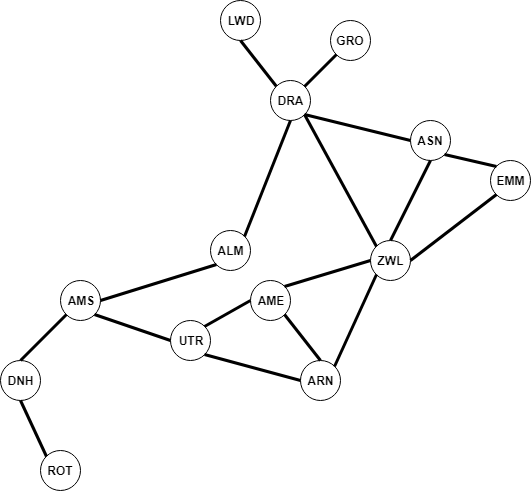

# Graph algorithms

This repository contains various graph algorithms.

## Applied examples

 1. [Passcode derivation (Project Euler)](/passcode_derivation.md)
 2. Mathematics prerequisite scheduling
 3. ...

## Terminology

This is an overview of the terminology:

 * _degree_: the number of edges for a vertex.
 * _connected_: a graph is _connected_ if all vertices can be reached from any vertex `v`.
 * _cyclic_: a graph is called _cyclic_ if there is a path from `v` to itself with a minimum path length that is greater than 2. If a graph is not cyclic, it is called _acyclic_.
 * _eccentricity_: the _eccentricity_ of a vertex `v` is the length of the shortest path from that vertex to the furthest vertex from `v`.
 * _diameter_: the _diameter_ of a graph is the maximum eccentricity of any vertex.
 * _radius_: the _radius_ of a graph is the minimum eccentricity of any vertex.
 * _center_: any vertex is a _center_ if it's eccentricity is the radius.
 * _Wiener index_: the _Wiener index_ of a graph is the sum of the lengths of the shortest possible paths between all pair of vertices.
 * _girth_: the _girth_ of a graph is the length of the shortest cycle in the graph.

## Example

### Example with `Graph`

The following example will show the basics.


The following text can be used with the `GraphBuilder` to generate the graph.

```
12
16
8 4
2 3
1 11
0 6
3 6
10 3
7 11
7 8
11 8
2 0
6 2
5 2
5 10
5 0
8 1
4 1
```

Load the graph in the following way:

```csharp
var graph = GraphBuilder.GenerateGraph("../../../graph2.txt", allowSelfLoop: false, allowParallelEdges: false);
Console.WriteLine(graph.ToString());
```

This yields the following information about the graph:

```
0: 6 2 5 (degree: 3)
1: 11 8 4 (degree: 3)
2: 3 0 6 5 (degree: 4)
3: 2 6 10 (degree: 3)
4: 8 1 (degree: 2)
5: 2 10 0 (degree: 3)
6: 0 3 2 (degree: 3)
7: 11 8 (degree: 2)
8: 4 7 11 1 (degree: 4)
9: (degree: 0)
10: 3 5 (degree: 2)
11: 1 7 8 (degree: 3)
Max degree: 4
Average degree: 2,66666666666667
```

To find all the connected components in this graph, use the `ConnectedComponent` object:

```csharp
var cc = new ConnectedComponents(graph);
Console.WriteLine(cc.ToString());
```

Which result in the followng connected components:

```
Connected components (3 components):
0: 0 2 3 5 6 10
1: 1 4 7 8 11
2: 9
The graph is disconnected.
```

A graph is said to be _disconnected_ if it has more than a single component (multiple subgraphs).

### Example with `SymbolGraph`

The following graph is a -- not very accurate -- map of The Netherlands.



The graph can be created with `GraphBuilder` and the following text:

```
LWD DRA
DRA GRO
ASN DRA
ALM DRA
ASN EMM
ZWL EMM
ZWL ASN
DRA ZWL
AMS ALM
AME ZWL
AME ARN
ARN ZWL
UTR ARN
AMS UTR
AMS DNH
DNH ROT
UTR AME
```

If we create the graph, and run the simple analysis:

```csharp
var graph = GraphBuilder.GenerateSymbolGraph("../../../routes_nl.txt", allowSelfLoop: false, allowParallelEdges: false);
Console.WriteLine(graph.ToString());

var cc = new ConnectedComponents(graph.Graph);
Console.WriteLine("\r\n" + cc.ToString());
```

We will get the following result:

```
LWD: DRA (degree: 1)
DRA: LWD GRO ASN ALM ZWL (degree: 5)
GRO: DRA (degree: 1)
ASN: DRA EMM ZWL (degree: 3)
ALM: DRA AMS (degree: 2)
EMM: ASN ZWL (degree: 2)
ZWL: EMM ASN DRA AME ARN (degree: 5)
AMS: ALM UTR DNH (degree: 3)
AME: ZWL ARN UTR (degree: 3)
ARN: AME ZWL UTR (degree: 3)
UTR: ARN AMS AME (degree: 3)
DNH: AMS ROT (degree: 2)
ROT: DNH (degree: 1)
Max degree: 5
Average degree: 2,61538461538462

Connected components (1 component):
0: 0 1 2 3 4 5 6 7 8 9 10 11 12
The graph is connected.
```

If we want to find the shortest path from `DRA` to `UTR`:

```csharp
var bfs = new BreadthFirstPaths(graph.Graph, graph.Index("DRA"));
var sb = new StringBuilder();
foreach (var v in bfs.PathTo(graph.Index("UTR")))
    sb.Append($"{graph.Name(v)}->");
Console.WriteLine(sb.ToString().Substring(0, sb.ToString().Length - 2));
```

Which gives the following route:

```
DRA->ALM->AMS->UTR
```

We can also find more useful information about a graph with `GraphProperties`:

```csharp
var prop = new GraphProperties(graph.Graph);
Console.WriteLine(prop.ToString());
```

Which gives the following information:

```
Diameter: 7
Radius: 4
Center: 4
Wiener-index: 277
Cyclic: yes
Girth: 3
Eccentricities:
  0 with eccentricity 6
  1 with eccentricity 5
  2 with eccentricity 6
  3 with eccentricity 6
  4 with eccentricity 4
  5 with eccentricity 7
  6 with eccentricity 6
  7 with eccentricity 5
  8 with eccentricity 5
  9 with eccentricity 5
  10 with eccentricity 5
  11 with eccentricity 6
  12 with eccentricity 7
```

## API

### Graph

The `Graph` object requires a number of `vertices`. If `allowSelfLoops` is set to `true`, the graph will not check for self-loops when calling `AddEdge`. If `allowParallelEdges` is set to `true`, the graph will not check if the edge already exists when calling `AddEdge`. Both are set to `true` by default.

The `Graph` object contains the following properties/methods:

 * `Vertices` returns the number of vertices.
 * `Edges` returns the number of edges.
 * `void AddEdge(int v, int u)` adds an edge from `v` to `u`.
 * `IEnumerable<int> Adjacent(int v)` returns an `IEnumerable` for the adjacent vertices of `v`.
 * `override string ToString()` returns a string representation of the graph.
 * `int Degree(int v)` returns the degree of vertex `v`.
 * `int MaxDegree()` returns the max degree of the graph.
 * `int AverageDegree()` returns the average degree of the graph, which is `2 * E / V`.
 * `ParallelEdgesOrSelfLoopsAllowed` returns `true` if `allowSelfLoops` or `allowParallelEdges` is set.

 The graph can throw the following exceptions:

 * `SelfLoopException` is raised when a self-loop is created and `allowSelfLoops` is `false`.
 * `ParallelEdgeException` is raised when a duplicate edge is created and `allowParallelEdges` is `false`.

 ### Digraph

The `Digraph` object requires a number of `vertices`. If `allowSelfLoops` is set to `true`, the graph will not check for self-loops when calling `AddEdge`. If `allowParallelEdges` is set to `true`, the graph will not check if the edge already exists when calling `AddEdge`. Both are set to `true` by default.

The `Diraph` object contains the following properties/methods:

 * `Vertices` returns the number of vertices.
 * `Edges` returns the number of edges.
 * `void AddEdge(int v, int u)` adds an edge from `v` to `u`.
 * `IEnumerable<int> Adjacent(int v)` returns an `IEnumerable` for the adjacent vertices of `v`.
 * `override string ToString()` returns a string representation of the graph.
 * `Digraph Reverse()` returns the digraph with reversed edges.
 * `int DegreeOut(int v)` returns the degree of vertex `v`.
 * `int MaxDegreeOut()` returns the max degree of the graph.
 * `int AverageDegreeOut()` returns the average degree of the graph, which is `E / V`.
 * `ParallelEdgesOrSelfLoopsAllowed` returns `true` if `allowSelfLoops` or `allowParallelEdges` is set.

 The graph can throw the following exceptions:

 * `SelfLoopException` is raised when a self-loop is created and `allowSelfLoops` is `false`.
 * `ParallelEdgeException` is raised when a duplicate edge is created and `allowParallelEdges` is `false`.

### DepthFirstPaths

The `DepthFirstPaths` object will run the DFS algorithm on the graph. The object requires a `Graph` and a source vertex `s`. If `detailedTrace` is set to `true`, the algorithm will print a detailed trace.

The `DepthFirstPaths` object contains the following methods:

 * `bool HasPathTo(int v)` returns `true` if there is a path from the source `s` to `v`.
 * `IEnumerable<int> PathTo(int v)` returns an `IEnumerable` with the path from the source `s` to `v`.

### BreadthFirstPaths

The `BreadthFirstPaths` object will run the BFS algorithm on the graph. The paths from BFS are shortest paths. The object requires a `Graph` and a source vertex `s`. 

The `BreadthFirstPaths` object contains the following methods:

 * `bool HasPathTo(int v)` returns `true` if there is a path from the source `s` to `v`.
 * `IEnumerable<int> PathTo(int v)` returns an `IEnumerable` with the path from the source `s` to `v`.
 * `int DistanceTo(int v)` returns the distance from the source `s` to `v`.
 
### DirectedDFS

The `DirectedDFS` object will run the DFS algorithm on a digraph. The object requires a `Digraph` and a source vertex `s`, or a list of vertices.

The `DirectedDFS` object contains the following methods:

 * `bool Marked(int v)` return `true` if a vertex `v` is accessible from `s`.
 * `override string ToString()` returns a string representation of the reachable vertices.

### DepthFirstOrder

The `DepthFirstOrder` object will generate various orders of the digraph. Thse methods are useful in advanced graph-processing algorithms. The constructor requires a `Digraph` object.

The `DepthFirstOrder` object contains the following methods:

 * `IEnumerable<int> Pre()` returns an enumerator with the vertices in preorder.
 * `IEnumerable<int> Post()` returns an enumerator with the vertices in postorder.
 * `IEnumerable<int> ReversePost()` returns an enumerator with the vertices in reverse postorder.

### Topological

The `Topological` object will sort a directed acyclid graph (DAG) in topological order. The constructor requires a `Digraph` object.

The `Topological` object contains the following methods:

 * `IEnumerable<int> Order()` returns an enumerator with the vertices of the DAG in topological order.

### SymbolGraph

The `SymbolGraph` object is a symbol table wrapper on the `Graph` object. It will map strings to an index-based graph. The constructor requires a `List<Tuple<string, string>>` of inputs, where each tuple is a from/to edge. It also has the `allowSelfLoops` and `allowParallelEdges` checks.

The `SymbolGraph` object contains the following properties/methods:

 * `bool Contains(string s)` returns `true` if the graph contains the symbol `s`.
 * `IEnumerable<string> Keys` returns an `IEnumberable` with the keys.
 * `int Index(string s)` returns the integer index of the symbol `s`.
 * `string Name(int v)` returns the symbol for the integer index `v`.
 * `Graph Graph` returns the graph with integer indices.
 * `override string ToString()` returns a string representation of the graph.

### ConnectedComponents

The `ConnectedComponents` object detects all the connected components within the graph. It will return a list of subgraphs. The constructor requires an `IGraph` object, either a `Graph` or `Digraph`.

The `ConnectedComponents` object contains the following properties/methods:

 * `bool Connected(int v, int w)` returns `true` if the vertices `v` and `w` are connected.
 * `int Id(int v)` returns the component id of the vertex `v`.
 * `int Count` returns the count of the components.
 * `bool IsConnected` will return `true` if the graph is connected, i.e. there is only one component.

### Cycle

The `Cycle` object will detect if a graph is cyclic. This assumes that the graph doesn't have any parallel edges or self-loops. The object requires a `Graph` object.

The `Cycle` object has the following property:

 * `HasCycle` returns `true` if the graph is cyclic.

### DirectedCycle

The `DirectedCycle` object will detect cycles in a digraph. It will the path of the cycle. The object requires a `Digraph` object.

The `DirectedCycle` object has the following methods:

 * `bool HasCycle()` return `true` if the digraph has a cycle.
 * `IEnumerator<int> Cycle()` returns an enumerator for the path.

### TwoColor

The `TwoColor` object will check if the graph is bipartite, which means it can be colored with two colors, such that no adjacent vertices have the same color. The object requires a `Graph` object.

The `TwoColor` object has the following property:

 * `IsBipartite` returns `true` if the graph is two colorable.

### GraphProperties

The `GraphProperties` object gives additional information about a graph. This requires the graph to be connected (no subgraphs). The object requires a `Graph` object.

The `GraphProperties` contains the following properties/methods:

 * `int Eccentricity(int v)` returns the eccentricity of a vertex `v`.
 * `int Diameter()` returns the diameter of the graph.
 * `int Radius()` returns the radius of the graph.
 * `int Center()` returns a center vertex.
 * `int WienerIndex()` returns the Wiener index of the graph.
 * `bool Cyclic()` returns `true` if the graph is cyclic. Uses the `Cycle` object.
 * `int Girth()` returns the girth of the graph.

The `Cyclic()` method requires the graph to have `ParallelEdgesOrSelfLoopsAllowed` evaluate to `false`. If the graph is not connected, it will raise an `NotConnectedGraphException` exception.

### GraphBuilder

The `GraphBuilder` object contains static methods to generate graphs. The `GraphBuilder` object contains the following methods:

 * `Graph GenerateGraph(string file, bool allowSelfLoop = true, bool allowParallelEdges = true)`.
 * `SymbolGraph GenerateSymbolGraph(string file, bool allowSelfLoop = true, bool allowParallelEdges = true)`.

#### `Graph` format

The text file format for a `Graph` is:
```
vertice_count
edge_count
from to
from to
...
```

#### `SymbolGraph` format

The text file format for a `SymbolGraph` is:

```
from to
from to
from to
...
```

### EuclideanGraph

The `EuclideanGraph` object will create an ugly image of a graph.

The `EuclideanGraph` object contains the following static method:

 * `static void ToImage(Graph g)` which will save the image to `graph_{DateTime.Now.ToString("yyyyMMdd_hhmmss_ffff")}.jpg` in the current working directory.
