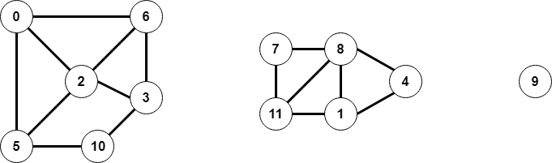

# Graph algorithms

This repository contains various graph algorithms.

## Terminology

This is an overview of the terminology:

 * _degree_: the number of edges for a vertex.
 * _connected_: a graph is _connected_ if all vertices can be reached from any vertex `v`.
 * _cyclic_: a graph is called _cyclic_ if there is a path from `v` to itself with a minimum path length that is greater than 2. If a graph is not cyclic, it is called _acyclic_.
 * _eccentricity_: the _eccentricity_ of a vertex `v` is the length of the shortest path from that vertex to the furthest vertex from `v`.
 * _diameter_: the _diameter_ of a graph is the maximum eccentricity of any vertex.
 * _radius_: the _radius_ of a graph is the minimum eccentricity of any vertex.
 * _center_: any vertex is a _center_ if it's eccentricity is the radius.
 * _Wiener index_: the _Wiener index_ of a graph is the sum of the lengths of the shortest possible paths between all pair of vertices.
 * _girth_: the _girth_ of a graph is the length of the shortest cycle in the graph.

## Example

### Example graph 1



The following text can be used with the `GraphBuilder` to generate the graph.

```
12
16
8 4
2 2
1 11
0 6
3 6
10 3
7 11
7 8
11 8
2 0
6 2
5 2
5 10
5 0
8 1
4 1
```

## API

### Graph

The `Graph` object requires a number of `vertices`. If `allowSelfLoops` is set to `true`, the graph will not check for self-loops when calling `AddEdge`. If `allowParallelEdges` is set to `true`, the graph will not check if the edge already exists when calling `AddEdge`. Both checks are set to `false` by default.

The `Graph` object contains the following properties/methods:

 * `Vertices` returns the number of vertices.
 * `Edges` returns the number of edges.
 * `void AddEdge(int v, int u)` adds an edge from `v` to `u`.
 * `IEnumerable<int> Adjacent(int v)` returns an `IEnumerable` for the adjacent vertices of `v`.
 * `string ToString()` returns a string representation of the graph.
 * `int Degree(int v)` returns the degree of vertex `v`.
 * `int MaxDegree()` returns the max degree of the graph.
 * `int AverageDegree()` returns the average degree of the graph, which is `2 * E / V`.

 The graph can throw the following exceptions:

 * `SelfLoopException` is called when a self-loop is created and `allowSelfLoops` is `false`.
 * `ParallelEdgeException` is called when a duplicate edge is created and `allowParallelEdges` is `false`.

### DepthFirstPaths

The `DepthFirstPaths` object will run the DFS algorithm on the graph. The object requires a `Graph` and a source vertex `s`. If `detailedTrace` is set to `true`, the algorithm will print a detailed trace.

The `DepthFirstPaths` object contains the following methods:

 * `bool HasPathTo(int v)` returns `true` if there is a path from the source `s` to `v`.
 * `IEnumerable<int> PathTo(int v)` returns an `IEnumerable` with the path from the source `s` to `v`.

### BreadthFirstPaths

The `BreadthFirstPaths` object will run the BFS algorithm on the graph. The paths from BFS are shortest paths. The object requires a `Graph` and a source vertex `s`. 

The `BreadthFirstPaths` object contains the following methods:

 * `bool HasPathTo(int v)` returns `true` if there is a path from the source `s` to `v`.
 * `IEnumerable<int> PathTo(int v)` returns an `IEnumerable` with the path from the source `s` to `v`.
 * `int DistanceTo(int v)` returns the distance from the source `s` to `v`.

### GraphBuilder

The `GraphBuilder` object contains static methods to generate graph objects.

